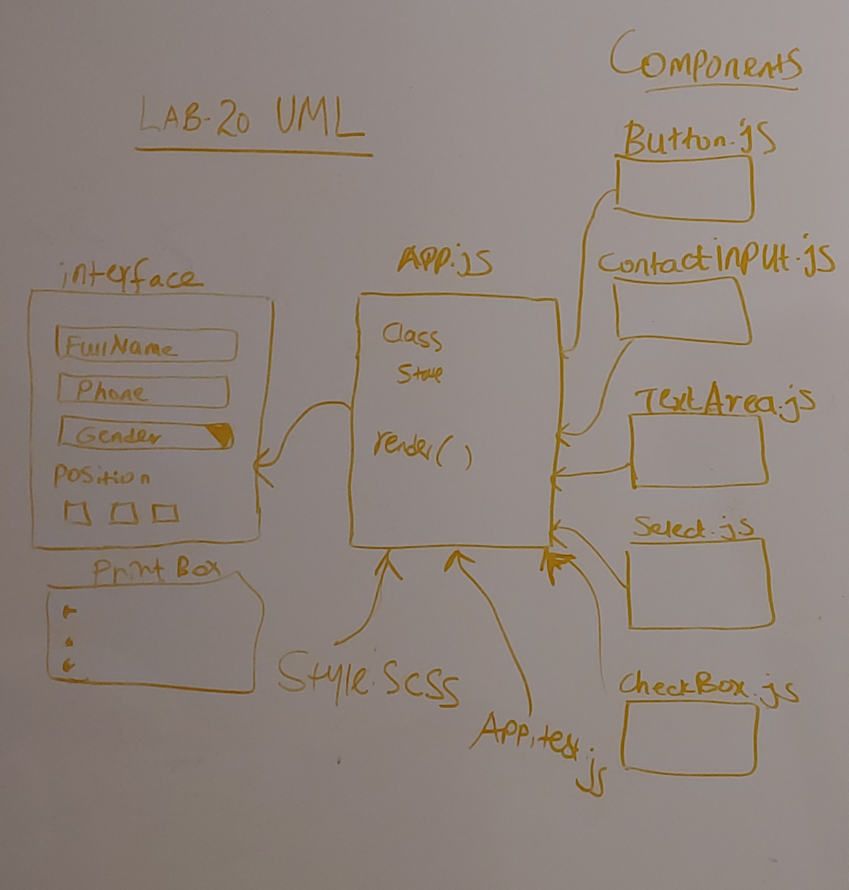

#### LAB - 20

#### Project:Props and State

##### Author: Meron

##### Links and Resources

- [CodeSandbox]()
- [netlify]( https://csb-kgd5r.netlify.com)
- [travis](https://www.travis-ci.com/malemu17/lab-20)

#### Documentation

- [jsdoc](comments only)
- [styleguide](https://github.com/shri/JSDoc-Style-Guide#functions)

##### Modules

- Button.js
- CheckBox.js
- Contactinput.js
- Select.js
- TextArea.js
- App.js

### Setup

- click on app codesandbox link from README.md

#### Running the app

- click on codesandbox link of the app 
  or npm start and use http://localhost:300 

#### Tests

- npm test

#### UML

* 
